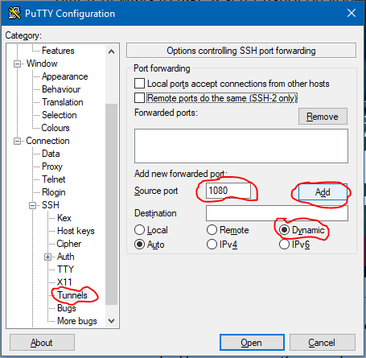
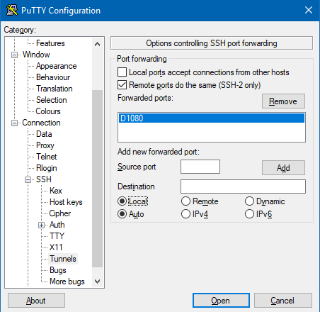
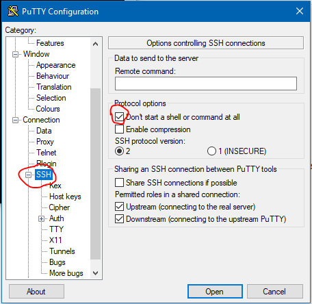
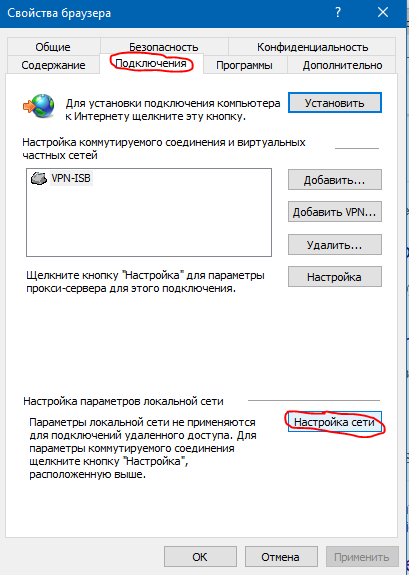

# Прокся на slack.

## Intro

Простой сокс5 прокси сервер был установлен на нашем облаке, чтобы использовать его для доступа к Слаку в случае проблем с локальным провайдером. Прокси работает только через туннель. Это, в общем-то, фундаментальное ограничение, так как через туннель происходит авторизация, а браузеры не авторизуют вход на прокси сервер.

Итак, как это выглядит в целом. Сначала вы создаете ssh туннель на машину, на которой запущен прокси сервер. Затем вы конфигурируете прокси-соединение в вашем браузере, причем в качестве сервера выступает localhost - это "начало" туннеля, который вы создали через ssh.

Таким образом, каждый раз, когда вы захотите воспользоваться прокси соединением, вам придется создать туннель. Это не очень удобно, так как, например, если ваш лаптоп заснет, то туннель придется поднимать заново. Поэтому мы рекомендуем использовать отдельный браузер с настройками прокси для доступа к Слаку, а в вашем основном браузере использовать "обычный" интернет от локального провайдера.


## Как настроить туннель

# MAC, Linux

Откройте терминал и запустите каманду

`ssh proxy.nplcloud.com -p 2222 -l proxy -D localhost:1080 -N`

Введите пароль, который тут не приводится по соображениям безопасности.

Если все нормально, то вы увидите такое:

```
$ ssh proxy.nplcloud.com -p 2222 -l proxy -D localhost:1080 -N
The authenticity of host '[proxy.nplcloud.com]:2222 ([5.153.4.51]:2222)' can't be established.
ECDSA key fingerprint is SHA256:vojPv3AlYqm1o8RM1ywQ85O9vN3NDUxCs00H3xqlbhc.
Are you sure you want to continue connecting (yes/no)? нуы
Please type 'yes' or 'no': yes
Warning: Permanently added '[proxy.nplcloud.com]:2222,[5.153.4.51]:2222' (ECDSA) to the list of known hosts.
proxy@proxy.nplcloud.com's password: 


```
То есть после пароля - ничего нет. Но есть туннель. Переходите в секцию Настройка браузера

Для упрощения создания туннеля можно добавить следующую секцию в ваш .ssh/config

```
Host nplp
HostName proxy.nplcloud.com 
Port 2222
User proxy
DynamicForward 1080

```

Тогда вы сможете запустить тунель как: `ssh -N nplp`

### Windows

Настройте новую сессию Putty на proxy@proxy.nplcloud.com port 2222

Будьте внимательны и настройте оцпии ssh:

настраиваем ткннель:



должно выглядеть вот так:



настраиваем, чтоб не выходило из терминала:



Не забудьте сохранить сессию!

Открываем, вводим пароль, при успешном логине ничего не происходит, промпта нет.

## Настройка браузера

Так как неразумно использовать прокси для всего вашего трафика все время, то предлагаю взять для этого дела неиспользуемый браузер, и выделить его для нашего Слака. Например, я пользуюсь файрфоксом в качестве основного браузера и сконфигурирую chromium для Слака с проксёй.

## На примере Хром

Хром на Линукс и MAC OS почему-то не поддерживает натройку прокси через Settings, поэтому два пути ниже. А под Windows настройка прокси системная, смотрите описание настройки Internet Explorer. (Таким образом, вы не можете использовать Chrome и Internet Explorer для разных целей - они либо вместе без прокси, либо вместе с прокси.)

### В командной строке

`chromium-browser --proxy-server=socks5://localhost:1080`

### С помощью расширения

Устанавливаем 
https://chrome.google.com/webstore/detail/proxy-helper/mnloefcpaepkpmhaoipjkpikbnkmbnic

и настраиваем в соответствие с картинкой


## На примере Файрфокс

Preferences->General->Network Proxy->Settings...


### Safari

Your description here

### Internet Explorer

Настройки Брузера-Соединения-




### Edge

Your description here

## Проверка

Зайдите на сайт ifcofig.io и проверьте, что ваш адрес начинается с 5...


